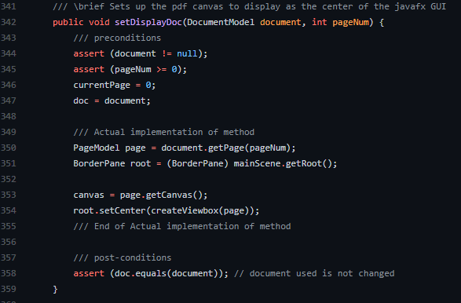
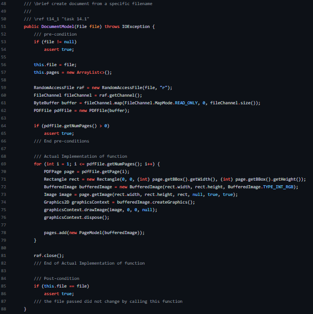
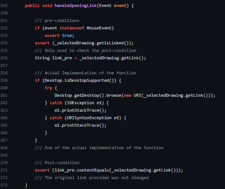

# Program By Contract

## 5 non-trivial functions, methods, or classes have documented contracts.

### Function 1: setDisplayDoc(DocumentModel document, int pageNum)

The screenshot below shows the documented contract for **setDisplayDoc** method of App class, which includes, preconditions, post-conditions and invariant assertions within implementation.

### Function 2: DocumentModel(File file)

The screenshot below shows the documented contract for **DocumentModel** method of DocumentModel class, which includes, preconditions, post-conditions and invariant assertions within implementation.

### Function 3: export(File dest)

The screenshot below shows the documented contract for **export** method of DocumentModel class, which includes, preconditions, post-conditions and invariant assertions within implementation.

### Function 4: handleRightClick(Event event)

The screenshot below shows the documented contract for **handleRightClick** method of Select class, which includes, preconditions, post-conditions and invariant assertions within implementation.

### Function 5: handleOpeningLink(Event event)

The screenshot below shows the documented contract for **handleOpeningLink** method of Select class, which includes, preconditions, post-conditions and invariant assertions within implementation.

