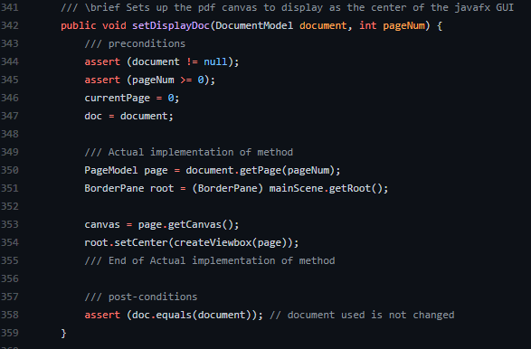
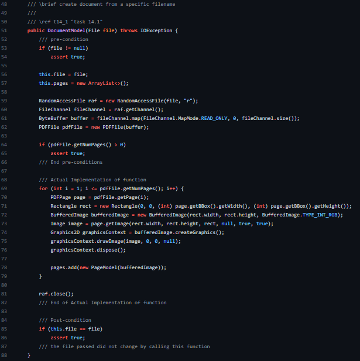
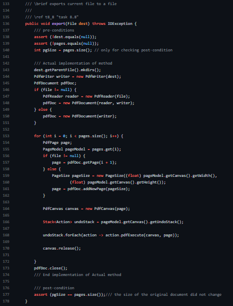
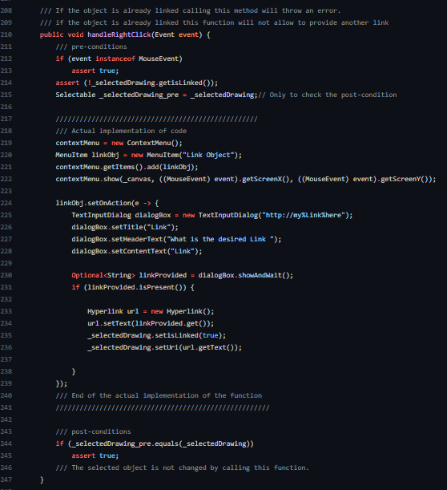
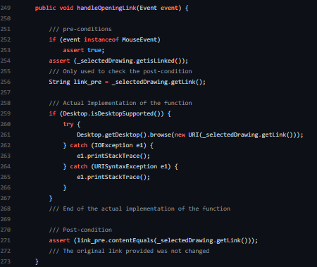

# Literate Programming

## 5 non-trivial functions meet the described characteristics of literate programming.

### Function 1: setDisplayDoc(DocumentModel document, int pageNum)

Below is the screenshot of the function (from App class) and also the description which satisfies the requirements for literate programming.

- [x] Method or function names and arguments must be self documenting.

From the above image it can be seen that the method name "setDisplayDoc" and the arguments "document, pageNum" are self documenting.

- [x] Named data types must be used as a form of documentation.

In the above image the data type of document is DocumentModel and that of pageNum is int.

- [x] Contractual elements like acceptable values, preconditions, and postconditions must be documented.

From the above image it can be seen that the preconditions are that the document cannot be null and the pageNum must be greater than or equal to 0. While the post condition is that the original document which is to be displayed is not changed/modified.

- [x] Formatted documentation must explain WHY each function or method exists.

By looking at the formatted documentation it explains that this method exists to display the PDF canvas as the center of the GUI.

### Function 2: DocumentModel(File file)

Below is the screenshot of the function (from DocumentModek class) and also the description which satisfies the requirements for literate programming.

- [x] Method or function names and arguments must be self documenting.

From the above image it can be seen that the method name "DocumentModel" and the argument "file" are self documenting.

- [x] Named data types must be used as a form of documentation.

In the above image the data type of file is File.

- [x] Contractual elements like acceptable values, preconditions, and postconditions must be documented.

From the above image it can be seen that the preconditions are that the file cannot be null and the pages of the PdfFile must be greater than 0. While the post condition is that the file which was passed did not change/modify.

- [x] Formatted documentation must explain WHY each function or method exists.

This particular method exists to create a document for a specific file and also to satisfy the requirement of task 14.1.

### Function 3: export(File dest)

Below is the screenshot of the function (from DocumentModel class) and also the description which satisfies the requirements for literate programming.

- [x] Method or function names and arguments must be self documenting.

From the above image it can be seen that the method name "export" and the argument "dest" are self documenting.

- [x] Named data types must be used as a form of documentation.

In the above image the data type of dest is File.

- [x] Contractual elements like acceptable values, preconditions, and postconditions must be documented.

From the above image it can be seen that the preconditions are that the destination file cannot be null and the List<PageModel> pages cannot be null. While the post condition is that the size of the original document did not change.

- [x] Formatted documentation must explain WHY each function or method exists.

This particular method exists to export current file to a file and also to satisfy the requirement of task 8.8.

### Function 4: handleRightClick(Event event)

Below is the screenshot of the function (from Select class) and also the description of the function which satisfies the requirements for literate programming.

- [x] Method or function names and arguments must be self documenting.

From the above image it can be seen that the method name "handleRightClick" and the argument "event" are self documenting.

- [x] Named data types must be used as a form of documentation.

In the above image the data type of event is Event.

- [x] Contractual elements like acceptable values, preconditions, and postconditions must be documented.

From the above image it can be seen that the preconditions are that the event must be an instance of MouseEvent and selected drawing must not contain any link. While the post condition is that the selected object did not change. Hence, if the object is already having a link calling this method will throw an error and also will not let to provide a link.

- [x] Formatted documentation must explain WHY each function or method exists.

This particular method exists to handle the right click event which can be known from the self documenting name of the function itself and to satisfy the requirement of task 18.2.

### Function 5: handleOpeningLink(Event event)

Below is the screenshot of the function (from Select class) and also the description of the function which satisfies the requirements for literate programming.

- [x] Method or function names and arguments must be self documenting.

From the above image it can be seen that the method name "handleOpeningLink" and the argument "event" are self documenting.

- [x] Named data types must be used as a form of documentation.

In the above image the data type of event is Event.

- [x] Contractual elements like acceptable values, preconditions, and postconditions must be documented.

From the above image it can be seen that the preconditions are that the event must be an instance of MouseEvent and selected drawing must have a link attached to it. While the post condition is that the selected object's link did not change/modify by calling this method.

- [x] Formatted documentation must explain WHY each function or method exists.

This function is called to open the link attached to the object/shape and to satisfy the requirement of task 18.2.
